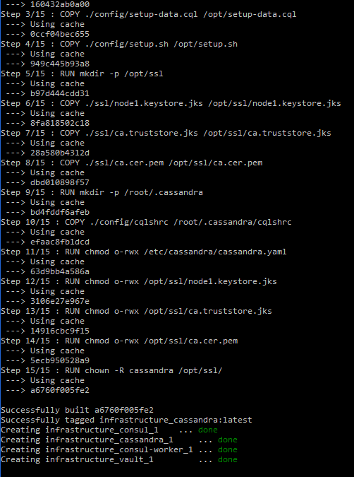
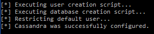
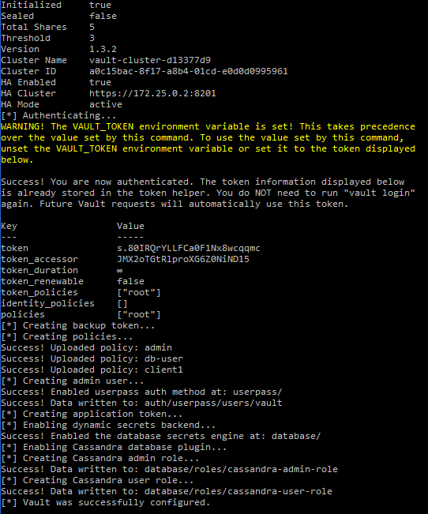
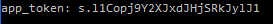
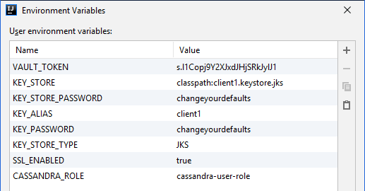
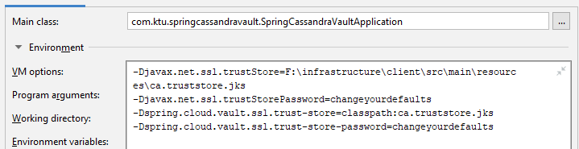
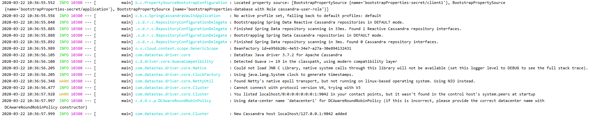
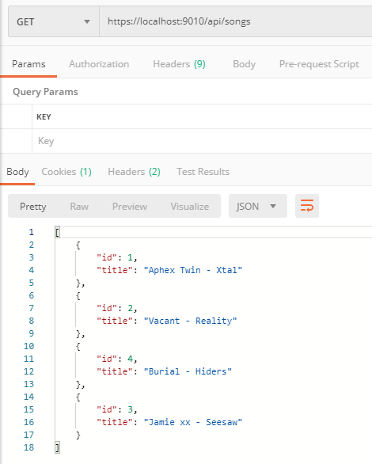
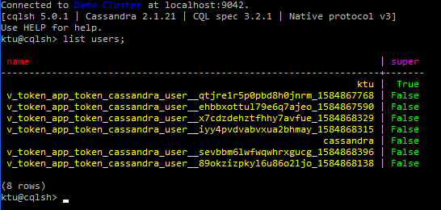

# Demonstracija

## Infrastruktūra
Pirmiausiai `infrastructure/.env-sample` pagrindu yra sukuriamas `infrastructure/.env` failas su globaliais kintamaisiais. Pvz.:
```
CASSANDRA_USERNAME=ktu
CASSANDRA_PASSWORD=ktu
DEFAULT_CASSANDRA_PASSWORD=ktu
VAULT_ADMIN_USERNAME=vault
VAULT_ADMIN_PASSWORD=vault
```

Tuomet infrastruktūra yra sukuriama paleidžiant komandą `docker-compose up -d --build`.



Sukūrus infrastruktūrą, Cassandra DBVS yra konfigūruojama vykdant komandą `docker exec -it infrastructure_cassandra_1 bash /opt/setup.sh`.



Tuomet Vault yra konfigūruojamas vykdant komandą `docker exec -it infrastructure_vault_1 bash /vault/config/setup.sh`.



Vault žetonas, skirtas klientui (taikomajai aplikacijai), yra gaunamas vykdant komandą `docker exec -it infrastructure_vault_1 cat /vault/app-token.txt`.



## Klientas
Taikomoji Spring Boot kliento aplikacija yra leidžiama naudojant IntelliJ IDEA integruotą kūrimo aplinką.

Aplikacijos globalieji kintamieji:



Aplikacijos VM nustatymai:



Paleidus aplikaciją, jos sisteminiame žurnale yra matoma, jog aplikacija prisijungė prie Vault, nuskaitė `cassandra-user-role` paslapties reikšmę ir gavo dinaminį prisijungimą, su kuriuo sėkmingai prisijungė prie Cassandra DBVS.



Pasileidus HTTP serveriui, galima kreiptis į API prieigos tašką, kuris nuskaitys visas dainas iš `songs` lentelės ir pateiks jas JSON formatu.



Prisijungus prie Cassandra DBVS, naudotojų sąraše galima matyti laikinus DBVS vartotojus, kuriuos sukūrė Vault.

