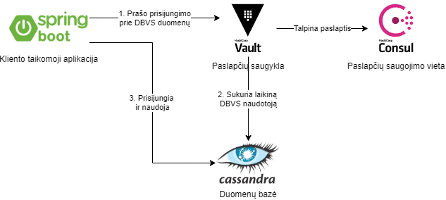

# Infrastruktūra

## Topologija

## Instrukcijos
### *Pastaba: Visos komandos yra leidžiamos iš pagrindinės direktorijos, kurioje yra šis failas.*

### Kintamųjų nustatymas
- `.env-sample` faile yra nurodyti reikalingų kintamųjų pavadinimai. Šio failo pagrindu sukurkite failą `.env` (šioje direktorijoje) ir užpildykite jį savo pasirinktais kintamaisiais.

### Infrastruktūros diegimas ir paleidimas
- `docker-compose up -d --build`

### Infrastruktūros pakartotinis paleidimas
- `docker-compose up`

### Apache Cassandra diegimas
- `docker exec -it infrastructure_cassandra_1 bash /opt/setup.sh`

### Hashicorp Vault diegimas
- `docker exec -it infrastructure_vault_1 bash /vault/config/setup.sh`

### Kliento žetono gavimas
- `docker exec -it infrastructure_vault_1 cat /vault/app-token.txt`

### Vault atidarymas po pakartotinio paleidimo
- `docker exec -it infrastructure_vault_1 bash /vault/config/unseal.sh`

### Infrastruktūros sunaikinimas
- `docker-compose down`