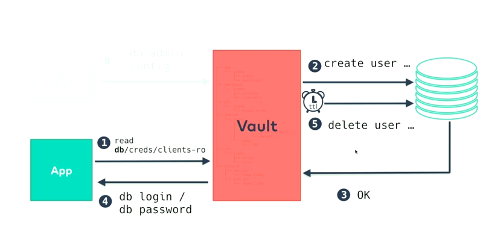
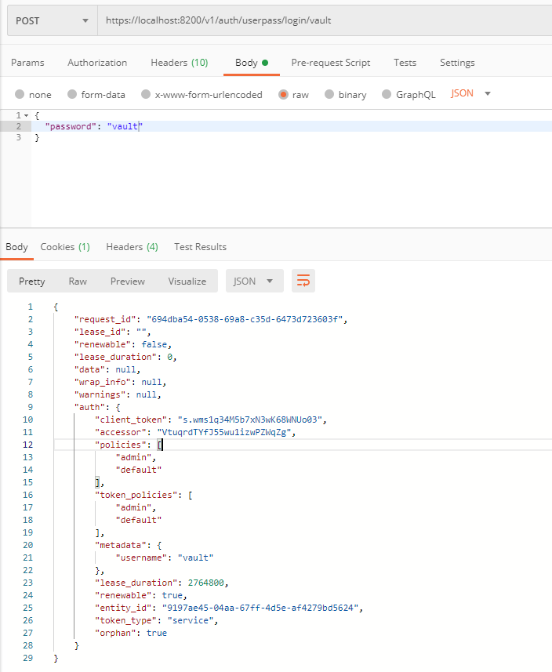
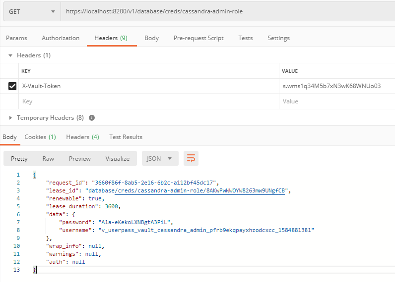

# HashiCorp Vault
HashiCorp Vault sistema yra skirta paslapčių bei jautrios informacijos valdymui ir apsaugojimui. Ši saugykla apsaugo, talpina bei valdo prieigą prie žetonų, slaptažodžių, sertifikatų, kriptografinių raktų. Šios paslaptys iš Vault gali būti gaunamos naudojant grafinę vartotojo sąsają, CLI įrankį ar HTTP API.

Vault saugykla paslaptis teikia autentifikuotiems naudotojams. Naudotojai gali autentifikuotis pateikdami vartotojo vardą ir slaptažodį, aktyvios direktorijos paskyros duomenis, Okta identiteto tiekėjo paskyros duomenis, RADIUS serverio paskyros duomenis, žetonus, TLS sertifikatus ar naudodami kitus [metodus](https://www.vaultproject.io/docs/auth/).

Vault gali talpinti ne tik statines paslaptis (pvz. statinį API žetoną), bet ir teikti dinamines paslaptis - t.y. sukurti tam tikrą autentifikacijos informaciją tada, kai jos yra paprašoma. Dinaminė paslaptis turi galiojimo laiką. Po tam tikro numatyto laiko ši autentifikacijos informacija tampa nebevalidi ir klientas turi kreiptis į Vault iš naujo, kad šis sukurtų naują dinaminę paslaptį. Dinaminių paslapčių pavyzdžiai galėtų būti AWS IAM rolė, SSH sertifikatas ar prisijungimo duomenys prie DBVS. 

Žemiau yra pateiktas dinaminės paslapties veikimo pavyzdys, kuomet yra prašoma prisijungimo prie DBVS.



## Konfigūracija
Vault konfigūracija yra saugoma `config/vault-config.json` faile.

Konfigūracijos parametrai:
- `backend.consul` - Nurodo, jog Vault duomenų saugojimui naudos `Consul` sistemą.
    - `address` - Nurodo `Consul` mazgo adresą.
    - `path` - Nurodo `Consul` kelią, kuriame bus saugomi duomenys.
- `listener.tcp` - Nurodo TCP ryšio nustatymus.
    - `address` - Nurodo Vault adresą su prievadu.
    - `tls_cert_file` - Nurodo TLS sertifikato failo kelią.
    - `tls_key_file` - Nurodo TLS rakto failo kelią.
    - `tls_disable` - Nurodo, ar TLS turi būti išjungtas.
- `ui` - Nurodo, ar Vault turi teikti grafinę vartotojo sąsają.

## Politikos taisyklės
Vault politikos taisyklės yra saugomos `policies` kataloge. 

Vault yra grįstas failų sistemos keliais. Jame esančios paslaptys yra saugomos atitinkamuose failų sistemos keliuose. Skirtingi paslapčių tipai yra saugomi skirtinguose paslapčių varikliuose (angl. *secret engines*), kurie turi šakninius failų sistemos kelius - prefiksus. Pavyzdžiui, rakto-reikšmės tipo paslaptys yra saugomos failų sistemoje, kurios šakninis kelias yra `secret/`.

Vault politikos taisyklės nusako, kokias paslaptis gali pasiekti ir valdyti tam tikri Vault naudotojai. Politikos taisyklėje yra nurodomas paslapties kelias ir veiksmai, galimi su šia paslaptimi ar jų grupe - skaitymas, rašymas, atnaujinimas, trynimas ar išvadinimas.

Apačioje yra pateikiamas taisyklės pavyzdys, nurodantis, jog naudotojas, turintis šią politikos taisyklę, gali skaityti ir išvadinti paslaptis, kurios yra `secret/data/client1/*` direktorijoje. Žvaigžtutė gale nurodo, jog taisyklė yra taikoma ne vienai paslapčiai, bet visai jų grupei, kurios yra nurodytoje direktorijoje.

```
path "secret/data/client1/*" {
    capabilities = ["read", "list"]
}
```

Politikos taisyklė yra sukuriama vykdant tokio formato komandą:

`vault policy write client1 /vault/config/client1_policy.hcl`.

Politikos taisyklė naudotojui yra priskiriama skirtingais būdais: pavyzdžiui, sukuriant žetoną:

`vault token create -display-name="app_token" -policy=client1`.

## Cassandra DBVS įskiepis
Siekiant panaudoti Vault dinaminių paslapčių teikiamą funkcionalumą su Cassandra DBVS, reikalingas atitinkamas [`cassandra-database-plugin`](https://www.vaultproject.io/api/secret/databases/cassandra.html) įskiepis.

Įskiepio parametrai:
- `hosts` - Nurodo Cassandra DBVS mazgą.
- `protocol_version` - Nurodo naudojamo protokolo versiją.
- `username` - Nurodo prisijungimo prie DBVS vardą.
- `username` - Nurodo prisijungimo prie DBVS slaptažodį.
- `allowed_roles` - Nurodo, kokioms rolėms galima prieiga prie DBVS.
- `tls` - Nurodo, ar turi būti naudojamas TLS.
- `skip_verification` - Nurodo, ar turi būti praleidžiamas TLS verifikavimas.

Įskiepio konfigūracija:
```
vault write database/config/ktu-cassandra-database \
    plugin_name="cassandra-database-plugin" \
    hosts=cassandra \
    protocol_version=3 \
    username=${CASSANDRA_USERNAME} \
    password=${CASSANDRA_PASSWORD} \
    allowed_roles=cassandra-user-role,cassandra-admin-role \
    tls=true \
    skip_verification=true
```

Sukonfigūravus įskiepį, galima sukurti DBVS roles.
```
vault write database/roles/cassandra-user-role \
    db_name=ktu-cassandra-database \
    creation_statements="CREATE USER '{{username}}' WITH PASSWORD '{{password}}' NOSUPERUSER; \
          GRANT SELECT ON ktuspace.songs TO {{username}};" \
    default_ttl="1h" \
    max_ttl="24h"
```

Rolės konfigūracija:
- `db_name` - Nurodo DB vardą, kuris turi sutapti su nurodytu konfigūracijos metu.
- `creation_statements` - CQL užklausos šablonas, kuris sukuria laikiną DBVS naudotoją.
- `default_ttl` - Nurodo, kiek laiko turėtų būti aktyvus sukurtas laikinas DBVS naudotojas.
- `max_ttl` - Nurodo maksimalų laikino DBVS naudotojo aktyvumo laiką.

Sukūrus rolę, naudotojai, kuriems priskirta politikos taisyklė tai leidžia atlikti, gali skaityti `database/creds/cassandra-user-role` paslaptį, kuri atitinkamai sukurs laikiną DBVS naudotoją ir jo prisijungimo duomenis pateiks Vault naudotojui.

## Diegimas
Vault diegimo metu yra vykdomas `config\setup.sh` scenarijus. Šis scenarijus:
- Atidaro Vault saugyklą ir prisijungia su `root` žetonu.
- Sukuria atsarginį žetoną, kuris yra patalpinamas `/vault/backup-token.txt` faile.
- Sukuria politikos taisykles.
- Sukuria naują administratoriaus paskyrą, kurios prisijungimo duomenys yra nurodomi `.env` faile: *VAULT_ADMIN_USERNAME* ir *VAULT_ADMIN_PASSWORD*. Šiai paskyrai yra priskiriama `admin` politikos taisyklė.
- Sukuriamas kliento (Spring Boot aplikacijos) žetonas su `db-user` ir `client1` politikos taisyklėmis.
- Sukonfigūruojamas `cassandra-database-plugin` įskiepis.
- Sukuriama administratoriaus `cassandra-admin-role` rolė.
- Sukuriama naudotojo `cassandra-user-role` rolė, kuri gali tik skaityti iš `ktuspace.songs` lentelės.

## REST API naudojimas
Dinaminę Cassandra DBVS paskyrą galima sukurti ir naudojant Vault REST API. Šis API gali būti naudojamas programuotojų, kurie nori gauti nuosavą laikiną paskyrą prisijungimui prie DBVS.

Pirmiausiai, naudotojas turi autentifikuotis ir pateikti savo paskyros vardą ir slaptažodį. Sėkmingai atlikus autentifikaciją, naudotojui yra grąžinamas žetonas (HTTP atsakymo kūne esantis `auth.client_token` laukas), kuris yra naudojamas tolimesnėse HTTP užklausose. Pavyzdinio naudotojo paskyros duomenys yra nurodomi `.env` failo `VAULT_ADMIN_USERNAME` ir `VAULT_ADMIN_PASSWORD` nustatymuose.



Tuomet naudojant žetoną (pridedant jį `X-Vault-Token` HTTP antraštėje), naudotojas gali kreiptis į Vault esančią `database/creds/cassandra-admin-role` paslaptį, kuris sukurs jam laikiną Cassandra DBVS paskyrą. Paskyros prisijungimo vardas ir slaptažodis yra pateikiami HTTP užklausos kūno `data.username` ir `data.password` laukuose.

