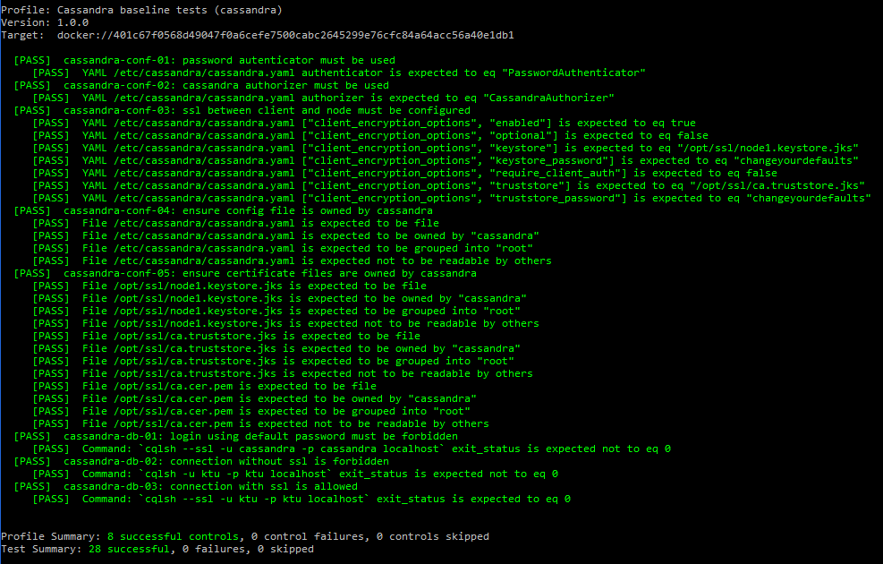
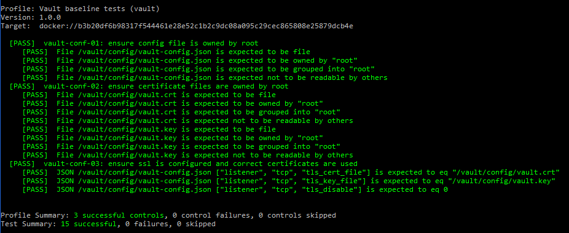
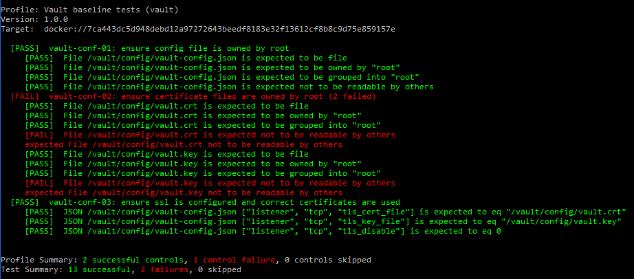

# Chef InSpec
Chef InSpec yra atviro kodo karkasas, skirtas testuoti bei audituoti aplikacijas bei infrastruktūrą. Chef InSpec tikrina realią aplikacijų ir infrastruktūros būseną su norima (angl. *baseline*), kuri yra apibūdinama lengvai skaitoma ir rašoma Chef InSpec sintakse. Chef InSpec aptinka neatitikimus ir pateikia juos ataskaitoje, kurią išanalizavus galima imtis klaidų ir neatitikimų taisymo.

Chef InSpec įrankis suteikia galimybę automatizuoti atitikties (angl. *compliance*) ir saugos reikalavimus, juos aprašant kaip testų kodą, kuris gali būti vykdomas reguliariai be žmogaus įsikišimo skirtingose infrastruktūrose. Šis automatizavimas leidžia sutaupyti žmonių laiko, išvengti žmogiškųjų klaidų bei ženkliai paspartinti neteisingos ir potencialiai nesaugios konfigūracijos aptikimą.

## Naudojimas
Testai gali būti leidžiami prisijungiant SSH protokolu į serverius arba nurodant Docker konteinerį. Kadangi mūsų infrastruktūra veikia Docker aplinkoje, testai bus vykdomi nurodant Docker konteinerį. 

Komandos sintaksė, kuri vykdo testus Docker konteineryje:

`inspec exec {testų rinkinio (direktorijos) pavadinimas} -t docker://{Docker konteinerio identifikatorius}`

Pavyzdinė komanda, kuri vykdo testus Vault Docker konteineryje:

`inspec exec vault -t docker://4c01db0b339c`

## Testų rezultatai

*Baseline* testai buvo rašomi Cassandra ir Vault infrastruktūros komponentams.

### Cassandra
Cassandra DBVS *baseline* testų rinkinys yra saugomas `cassandra/controls` direktorijoje.

Buvo sukurti du testų rinkiniai:
- `cassandra_conf.rb` - Tikrinamas `cassandra.yaml` konfigūracijos failas bei prieiga prie sertifikatų failų.
- `cassandra_db.rb` - Tikrinamas prisijungimas prie DBVS

Testų rezultatai:

### Vault
Vault *baseline* testų rinkinys yra saugomas `vault/controls` direktorijoje.

Buvo sukurtas vienas testų rinkinys:
- `vault_conf.rb` - Tikrinamas `vault-config.json` konfigūracijos failas bei prieiga prie sertifikatų failų.

Testų rezultatai:

Neteisingos konfigūracijos aptikimo pavyzdys:

